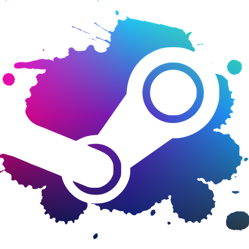
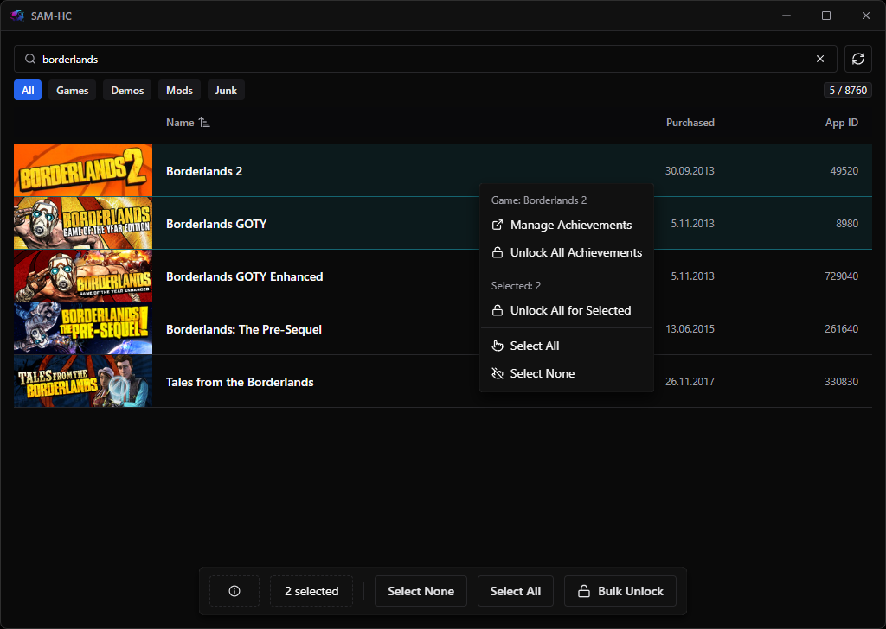
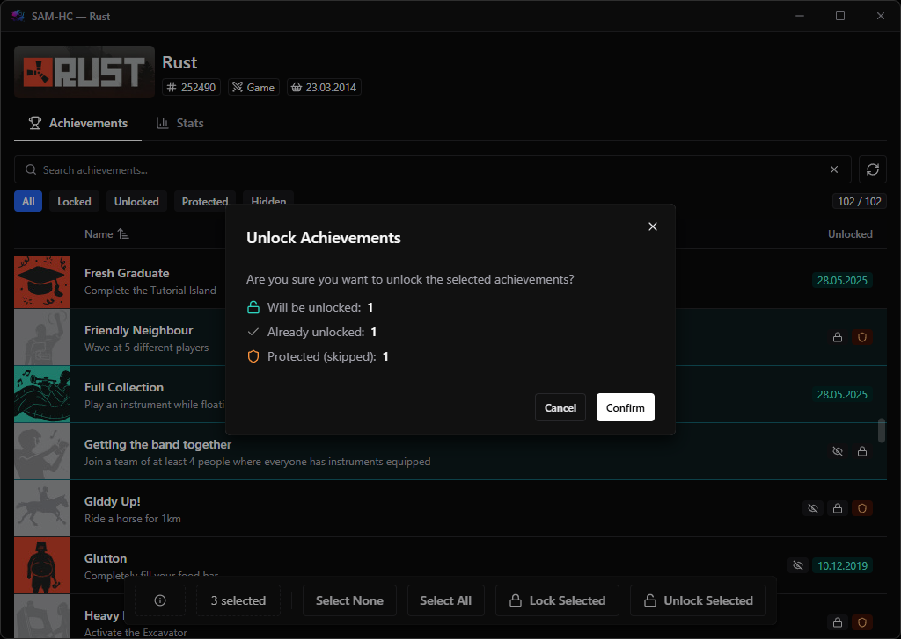
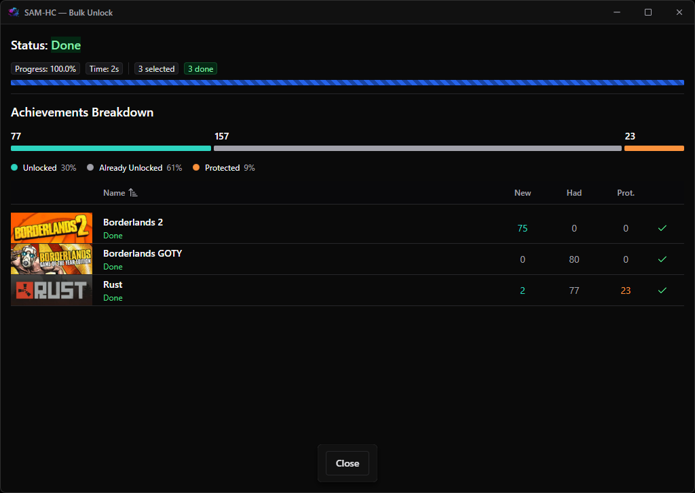

#  SAM-HC (Steam Achievement Manager)

A modern desktop app for managing Steam game achievements and statistics. Portable single-file executable — [download](https://github.com/pfrancug/SteamAchievementManager/releases/latest) and run.

Works with the [Steam](https://store.steampowered.com/about/) client.

## Features

- **Game Library** — browse, search, and filter your Steam games
- **Achievement Manager** — lock, unlock, and toggle achievements per game
- **Statistics Editor** — edit integer, float, and rate stats with validation
- **Bulk Unlock** — batch unlock achievements across multiple games
- **Protected Items** — read-only achievements and stats are marked and skipped in bulk operations
- **Multi-Window** — each game opens in its own window with a dedicated backend instance

| Game Library                      | Achievement Manager                     | Bulk Unlock                     |
| --------------------------------- | --------------------------------------- | ------------------------------- |
|  |  |  |

## Architecture

Electron shell spawning a .NET 10 backend per game window, communicating via SignalR over localhost.

| Layer    | Stack                                                    |
| -------- | -------------------------------------------------------- |
| Frontend | Vite, React 19, Chakra UI v3, TypeScript                 |
| Backend  | .NET 10, SignalR, Steam API via P/Invoke, self-contained |
| Shell    | Electron, multi-window, per-game backend process         |
| Shared   | TypeScript types for SignalR hub contracts               |

## License

Licensed under **zlib**. See [LICENSE](LICENSE).

Fork of [gibbed/SteamAchievementManager](https://github.com/gibbed/SteamAchievementManager).

## About

Developed by **Piotr Francug - HotCode**.

